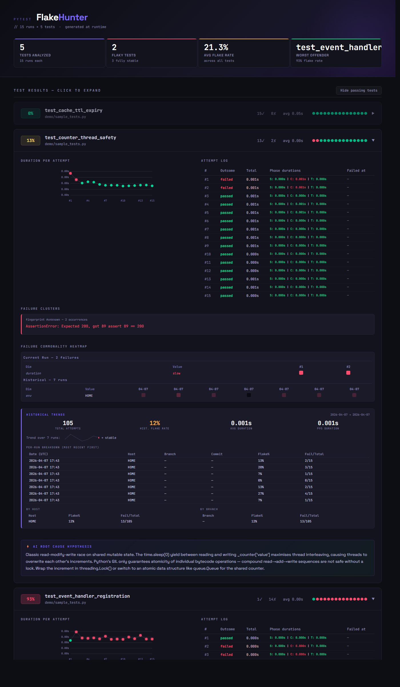

# pytest-flakehunter 🎯

**Re-run tests N times, visualize failure heatmaps, and get AI-powered root cause hypotheses.**

Flaky tests are expensive. They erode trust in CI, waste engineer time, and mask real bugs.
`pytest-flakehunter` helps you stop guessing and start diagnosing.

---

## What it does

Run any test suite with `--fh` and get a self-contained HTML report with:

- **Flake rate badges** per test — instantly see your worst offenders
- **Duration scatter plots** — spot timeout-related flakes vs. race conditions at a glance
- **Failure heatmaps** — shows *exactly* which line of code fails, and in which run attempts
- **Stack trace clustering** — groups failures by fingerprint so you know if it's one bug or three
- **AI root cause hypotheses** — Claude analyzes the clusters and tells you *why* it's probably flaking



---

## Installation

```bash
pip install pytest-flakehunter
```

## Usage

If you use `uv`, pass your `.env` file explicitly:
```bash
uv run --env-file=.env pytest tests/ --fh --fh-ai
```

```bash
# Basic: run each test 10 times, generate report
pytest tests/ --fh

# Custom run count
pytest tests/ --fh --fh-runs=20

# With AI analysis (requires ANTHROPIC_API_KEY env var)
pytest tests/ --fh --fh-runs=15 --fh-ai

# Custom report path
pytest tests/ --fh --fh-report=reports/flake_$(date +%Y%m%d).html

# Full fixture isolation between attempts (slower but catches session-state flakes)
pytest tests/ --fh --fh-isolate
```

## CLI options

| Option | Default | Description |
|--------|---------|-------------|
| `--fh` | off | Enable flake hunter mode |
| `--fh-runs N` | 10 | Re-run count per test |
| `--fh-report PATH` | `flakehunter_report.html` | Output report path |
| `--fh-ai` | off | AI root cause analysis via Claude |
| `--fh-history-dir PATH` | `.flakehunter/history` | Directory for persistent run history |
| `--fh-no-history` | off | Skip writing to history this run |
| `--fh-isolate` | off | Full fixture teardown between every attempt (see below) |

---

## Reading the report

### Duration scatter
Each dot is one run attempt. **Red = failed, green = passed.** 
- Failures clustering at a consistent high duration → likely a **timeout**
- Failures scattered at random durations → likely a **race condition or state issue**
- Single outlier failure at low duration → likely **environment or setup flake**

### Failure commonality heatmap
A multi-dimensional view of what your failures have in common.

**Current run** — columns are failed attempts, rows are:
- **Duration** — was this attempt slow, medium, or fast relative to the run? Helps spot timeout-related flakes.
- **Traceback** — which frames appeared in the stack trace, and in what % of failures.

**Historical** (when history is enabled) — columns are past runs, rows are:
- **Environment** — which host had failures, and how often.
- **Branch** — which git branch failures occurred on.
- **Date** — which week failures clustered in.

Cell brightness = how common that value is across failures. Bright = strong pattern.

### Stack trace clusters
Failures are grouped by a fingerprint of their innermost stack frames.
Multiple clusters = multiple distinct failure modes (e.g., two different bugs).
One cluster = one root cause, just intermittently triggered.

---

## Historical tracking

By default, flakehunter appends each run's results to per-test CSV files in `.flakehunter/history/`. These accumulate across runs, giving the report progressively richer data:

- **Flake rate trend** — see if a test is getting more or less flaky over time
- **Environment breakdown** — which CI host/branch has the most failures
- **Argument correlation** — for parametrized tests, which parameter combos fail most

To opt out for a single run:
```bash
pytest tests/ --fh --fh-no-history
```

To store history in a non-default location (e.g., shared network path):
```bash
pytest tests/ --fh --fh-history-dir=.cache/flakehunter
```

The CSV files are safe to commit — they're small, append-only, and give you a free audit trail.

---

## Fixture isolation

By default, flakehunter preserves session- and module-scoped fixtures across re-runs. This means a Playwright browser instance, database connection pool, or asyncio event loop is only created once per test — making repeated runs fast.

**When to use `--fh-isolate`:**

```bash
pytest tests/ --fh --fh-isolate
```

This passes a full teardown signal after every attempt, so every re-run starts with a completely clean fixture state. It is slower but will surface a class of flakiness that the default mode can miss — things like:

- Connection pools that degrade after a certain number of operations
- Session-scoped caches or queues that accumulate state
- Event loop pollution from uncancelled async tasks

If your tests are fast and stateless, the default is fine. If you're seeing flakiness that only appears after many runs in a long session, try `--fh-isolate`.

---

## AI analysis

Enable with `--fh-ai`. Requires an `ANTHROPIC_API_KEY` — set it using whichever method fits your workflow:

**Shell / CI environment variable** (recommended for CI):
```bash
# Linux / macOS
export ANTHROPIC_API_KEY=sk-ant-...
pytest tests/ --fh --fh-ai

# Windows CMD
set ANTHROPIC_API_KEY=sk-ant-...
pytest tests/ --fh --fh-ai

# Windows PowerShell
$env:ANTHROPIC_API_KEY = "sk-ant-..."
pytest tests/ --fh --fh-ai
```

**`.env` file** (recommended for local development — never commit this file):
```
# .env
ANTHROPIC_API_KEY=sk-ant-...
```
If you use `uv`, pass the file explicitly:
```bash
uv run --env-file=.env pytest --fh --fh-ai
```

> **Note:** Do not put your API key in `pytest.ini` or `pyproject.toml` — those files are typically committed to version control.

```
⚡ AI Root Cause Hypothesis

This test fails most often in setup_db_connection() after ~2.3s, which is
consistent with a connection pool exhaustion pattern under parallel test
execution. Consider increasing the test pool size or adding explicit
teardown that returns connections to the pool between retry attempts.
```

The AI receives the clustered stack traces, failure rates, and timing data —
not raw code — so it works on any codebase without needing source access.

---

## Architecture

```
pytest_flakehunter/
├── plugin.py       # pytest hooks: --fh option, re-run protocol, xdist support
├── reporter.py     # Self-contained HTML report with inline SVG charts
├── history.py      # Append-only CSV history per test, cross-run trend analysis
└── ai_analysis.py  # Anthropic API integration for root cause hypotheses
```

**No external dependencies** beyond pytest itself. The HTML report is fully
self-contained (no CDN calls, no JS frameworks) — safe to commit to repos or
attach to Jira tickets.

---

## Contributing

```bash
git clone https://github.com/jkasser/pytest-flakehunter
cd pytest-flakehunter
pip install -e ".[dev]"
pytest demo/sample_tests.py --fh --fh-runs=15
```

---

## License

MIT
